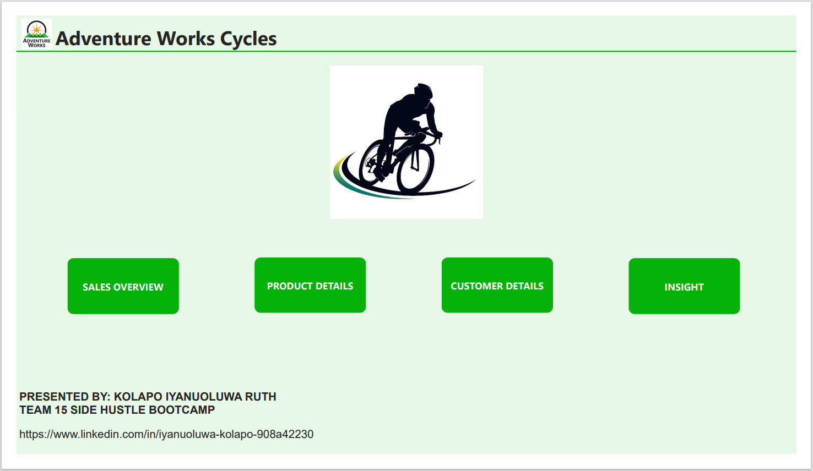
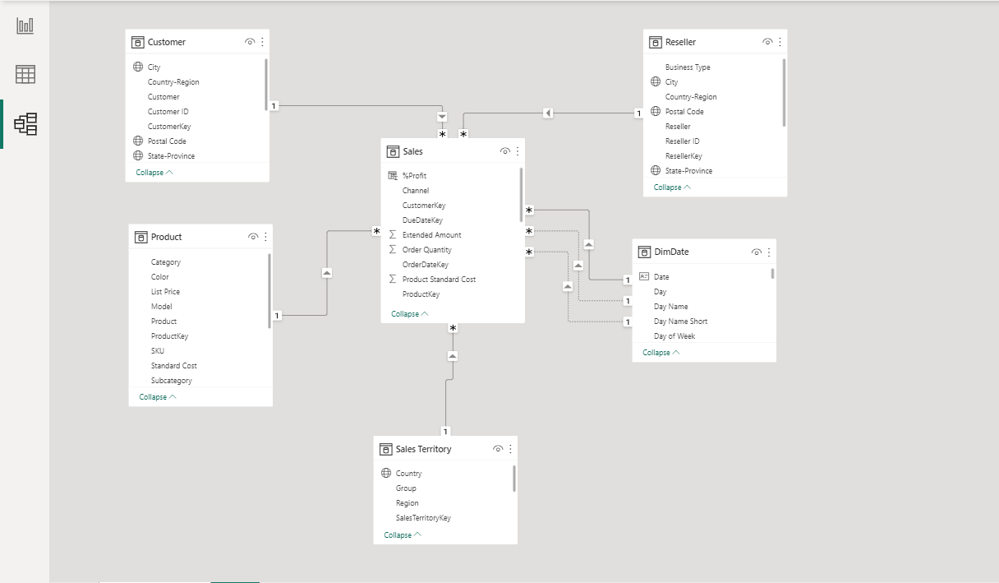
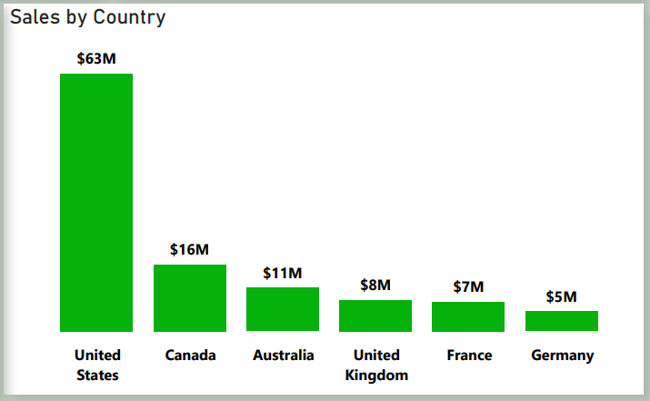
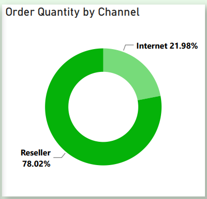
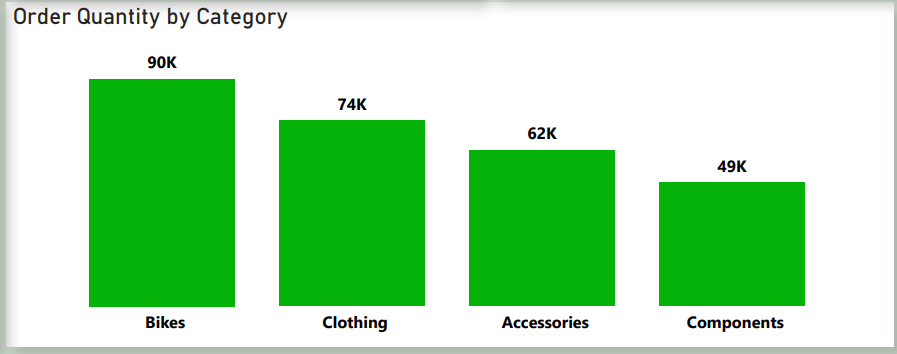
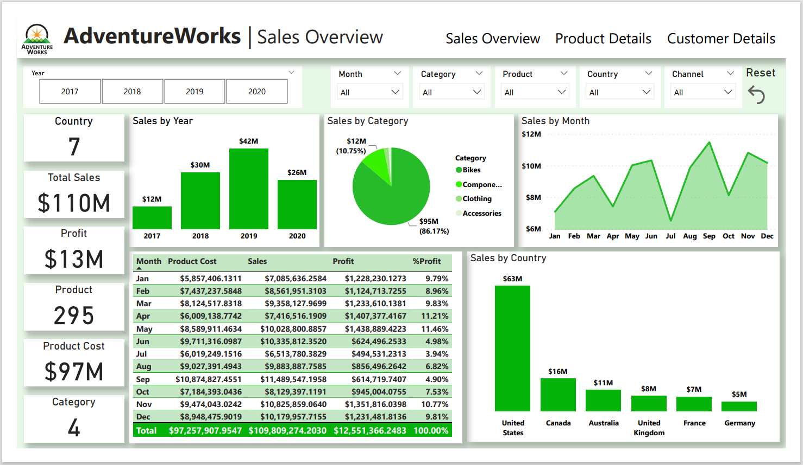
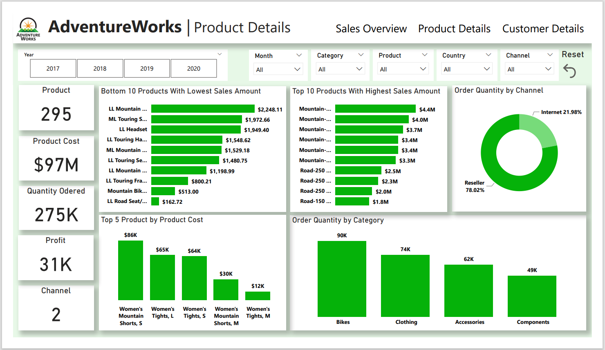
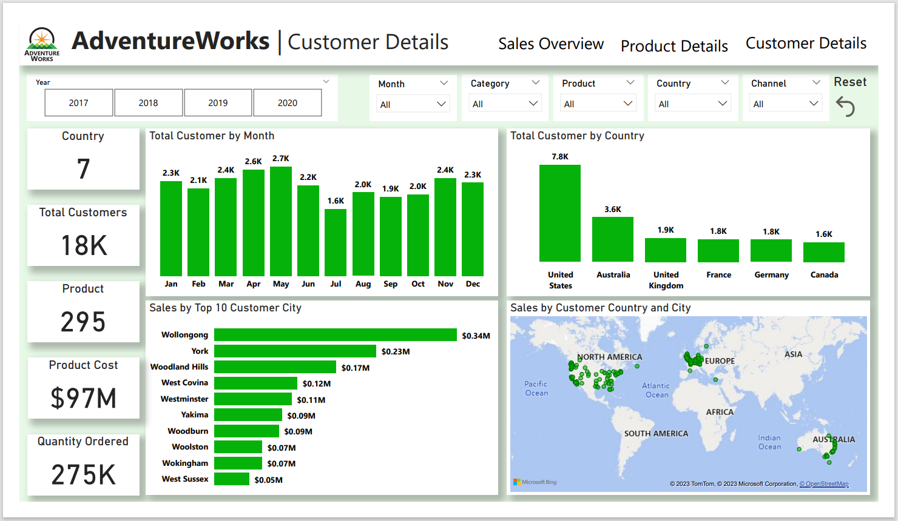
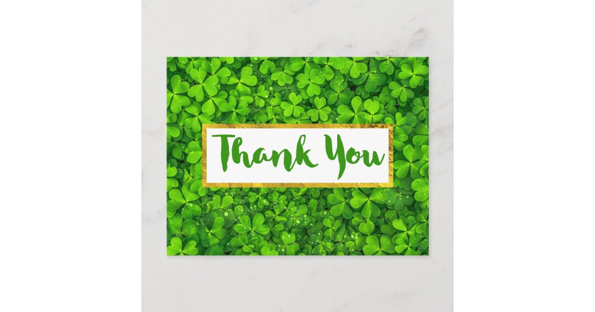

# Adventure Works

## Introduction
Using data on Adventure Works obtained from Kaggle, the project aimed to analyze the root causes of the decline in sales and customer satisfaction.

**_Disclaimer_**: _All datasets and reports do not represent any institution but just a dummy dataset to demonstrate the capabilities of Power BI_

## Problem Statement
This report analyzes the datasets and identifies the root causes of the decline in sales and customer satisfaction. The analysis includes identifying which products are selling well and which are not, which regions have high or low sales, and which customer demographics purchase the most or least. Examine customer feedback and complaints to identify areas for improvement, based on their analysis, recommendations were provided on how AdventureWorks can improve sales and customer satisfaction. This includes changes to their product offerings, marketing strategy, pricing strategy, or customer service approach.

## Skills Demonstrated
- Data Cleaning
- Data Modeling
- Data Merging
- Data Visualization

## Problem Approach
- I clean and remove duplicate and empty rows and  columns from the dataset
- I created pivot charts to answer each question
- I created an executive slicer to enable stakeholders to filter each region
- I created a date table through DAX

## Modelling
I created a one-to-many relationship
  

## Analysis
Sales by Country | Order Quantity by Channel | Order Quantity by Category
|----------------|---------------------------|----------------------------|
 |           | 

## Visualization

## Conclusion
- The company's total production cost is $97Million and made $110Million in total sales. The highest sales were recorded in the United States ($63Million) followed by Canada ($16Million), while the lowest sales were recorded in Germany ($5Million).
- According to the database given, the company made a profit of $1.8Million in 2017 within 6 months (July - December), $2.9Million in 2018, and $4.2Million in 2019 within 12 months (January -  December), and $3.7Million within 6 months (January - June). 
- The company has its highest sales ($42.9Million) and profit ($4.2Million) in 2019 .
- More product quantity is ordered through resellers (78.02%) than ordered from the internet (21.98%)
- Mountain-200 Black, 38 ($4.4 Million) is the best-selling product, followed by Mountain-200 Black, 42 ($4 Million). While LL Road Seat/Saddle ($162.72) has the lowest sales followed by Mountain Bike Socks, L($513).
- The company has 18 thousand customers, and they have their highest number of customers is from the United States (7,820), followed by Australia (3,592), while Canada has the lowest number of customers (1,572).
- Customers tend to buy products from the products in Bike category compare to the other categories.

## Recommendation
- The company should pay more attention to the stock of products which has the highest sales (Bikes) rather than stocking up products that are not highly demanded by customers.
- The company should encourage its customers to make use of the Internet channel as a means of ordering products by increasing the Internet user experience, especially for the Bikes and Components categories whose means of order is largely done through the reseller channel

